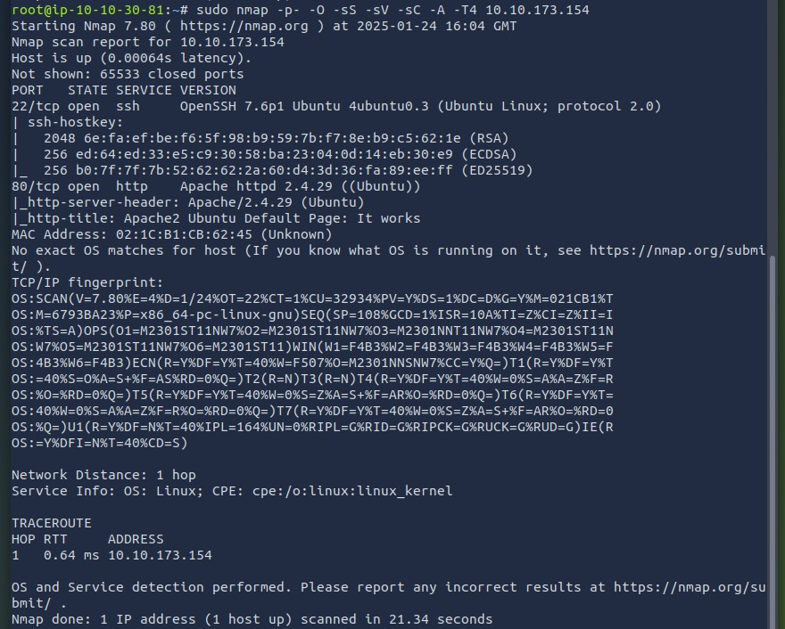

# Recon Assignment – Benjamin Hughes

## 📌 Objective
This project documents a vulnerability assessment conducted in the TryHackMe environment, targeting a simulated rogue device. The goal was to identify open ports, running services, OS fingerprinting, and potential vulnerabilities using Nmap.

## 🧰 Tools Used
- **TryHackMe Room**: [Internal](https://tryhackme.com/r/room/internal)
- **Nmap** for scanning
- **CyberChef** (for optional OCR processing)
- **Kali Linux / Attack Box** environment

## 🔍 Scan Summary

📄 A detailed PDF report is available in the [`docs/Hughes_Benjamin_Recon_Assignment.pdf`](docs/Hughes_Benjamin_Recon_Assignment.pdf) file.

**Target IP:** `10.10.173.154`  
**Command Used:**
```bash
sudo nmap -p- -O -sS -sV -sC -A -T4 10.10.173.154
```

### Open Ports & Services
| Port | Protocol | Service | Version                     |
|------|----------|---------|-----------------------------|
| 22   | TCP      | SSH     | OpenSSH 7.6p1 Ubuntu 4ubuntu0.3 |
| 80   | TCP      | HTTP    | Apache httpd 2.4.29 (Ubuntu) |

### Operating System
- Most likely: **Ubuntu Linux**
- OS Detection via TCP/IP fingerprinting inconclusive

### 🛡️ Vulnerabilities Identified

**OpenSSH 7.6p1**
- [CVE-2020-14145](https://nvd.nist.gov/vuln/detail/CVE-2020-14145) - MitM Attack (Medium)
- [CVE-2018-15919](https://nvd.nist.gov/vuln/detail/CVE-2018-15919) - Information Disclosure (Low)

**Apache 2.4.29**
- [CVE-2019-0211](https://nvd.nist.gov/vuln/detail/CVE-2019-0211) - Privilege Escalation (High)
- [CVE-2018-17199](https://nvd.nist.gov/vuln/detail/CVE-2018-17199) - Denial of Service (High)

## ✅ Recommendations
- Update Apache to version 2.4.62 or later
- Configure SSH for key-based authentication
- Disable root login via SSH

## 🖼️ Screenshot


## 📄 Scenario
The full assessment scenario is available in the [`docs/`](docs/) folder.

---
